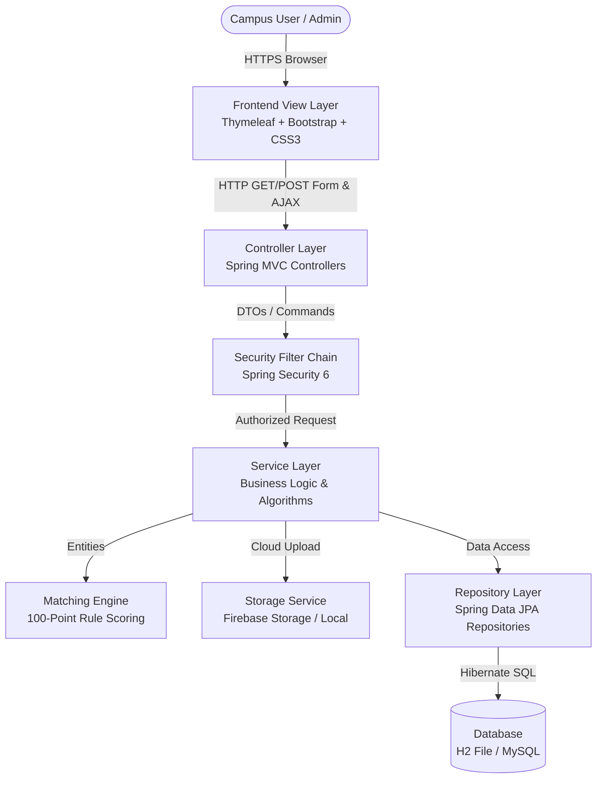
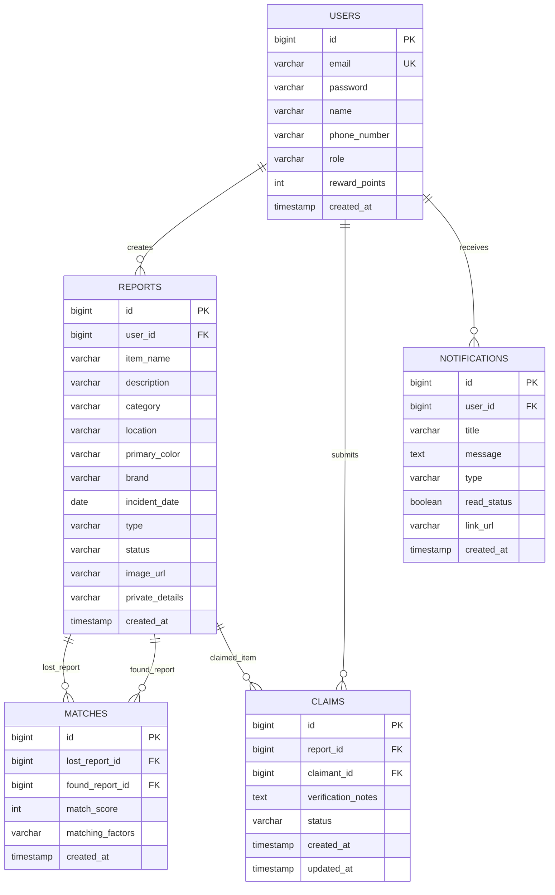

# Findora — Minimum Viable Product (MVP) Technical Specification

> **Project Name**: Findora — Smart College Lost & Found System  
> **Repository**: `akhil-a821/Findora`  
> **Application Type**: Full-Stack Responsive Web Application  
> **Release Version**: 1.0.0 (MVP)  
> **Default Local URL**: `http://localhost:8080/`  

---

## 1. Executive Summary & Problem Statement

### 1.1 The Campus Challenge
On modern college campuses, hundreds of valuable items—such as student ID cards, laptops, smartphones, earbuds, keys, wallets, and textbooks—are misplaced each semester. Traditional lost-and-found mechanisms suffer from significant operational bottlenecks:
- **Fragmented Channels**: Announcements scattered across WhatsApp groups, physical notice boards, and unorganized social media posts.
- **Privacy & Fraud Risks**: Publicly broadcasting serial numbers or identifying marks allows dishonest individuals to falsely claim items.
- **Lack of Incentives**: Finders have little motivation or frictionless means to report and return discovered items.
- **Zero Automation**: Students must manually scroll through weeks of unstructured posts with no matching intelligence.

### 1.2 The Findora Solution
**Findora** is a centralized, privacy-first, full-stack campus platform that streamlines the lost-and-found lifecycle. It pairs student reports through an **automated 100-point rule-based matching engine**, provides a **private verification claim workflow**, gamifies student participation with a **campus hero leaderboard**, and offers administrators an oversight dashboard.

---

## 2. Comprehensive Technologies Used

Findora is engineered using an enterprise-grade, modern open-source stack spanning backend services, relational data persistence, cloud asset storage, responsive templating, and custom styling systems.

```
+-------------------------------------------------------------------------+
|                              FINDORA MVP                                |
+-------------------------------------------------------------------------+
|   CLIENT / FRONTEND                                                     |
|   - Thymeleaf 3.1 Server-Side HTML5 Engine                              |
|   - Bootstrap 5.3.2 Responsive Grid & Layout Utility                    |
|   - Custom Vanilla CSS3 Design System (Glassmorphism, Restful Slate)    |
|   - Vanilla JavaScript ES6+ (DOM manipulation, AJAX Fetch API)          |
|   - FontAwesome 6.4.0 Icons & Google Plus Jakarta Sans Typography       |
+-------------------------------------------------------------------------+
|   BACKEND / APPLICATION LAYER                                           |
|   - Java 17 LTS (Eclipse Adoptium OpenJDK)                              |
|   - Spring Boot 3.2.2 Framework                                         |
|   - Spring MVC (RESTful & View Controllers, Model Binding, DTOs)        |
|   - Spring Security 6 (BCrypt Hashing, Session Management, RBAC)        |
|   - Spring Data JPA (Object-Relational Mapping & Repositories)          |
|   - Jakarta Bean Validation (Hibernate Validator)                       |
+-------------------------------------------------------------------------+
|   DATA & CLOUD STORAGE LAYER                                            |
|   - H2 Database (File-backed & In-Memory with auto-DDL update)          |
|   - MySQL 8.x Connector-J (Production-Ready enterprise persistence)     |
|   - Google Firebase Admin SDK 9.2.0 (Cloud Object Storage)              |
|   - Fallback Local Storage & Dynamic Category SVG Asset Generator       |
+-------------------------------------------------------------------------+
|   BUILD & DEVOPS TOOLING                                                |
|   - Apache Maven 3.9.6 Build Lifecycle Management                       |
|   - Spring Boot Maven Plugin 3.2.2                                      |
|   - Git Version Control                                                 |
+-------------------------------------------------------------------------+
```

### 2.1 Backend Technologies
| Technology | Version | Purpose & Implementation |
| :--- | :--- | :--- |
| **Java** | 17 LTS | Core object-oriented programming language; utilizes modern record patterns, sealed interfaces, and temporal APIs (`java.time.LocalDateTime`). |
| **Spring Boot** | 3.2.2 | Production-ready application framework providing dependency injection, auto-configuration, and embedded Tomcat 10 servlet container. |
| **Spring MVC** | 3.2.2 | Model-View-Controller architecture routing HTTP requests to controller handlers and binding data to Thymeleaf models. |
| **Spring Security** | 6.x | Security filter chain handling form-based login, logout, password encryption (`BCryptPasswordEncoder`), session security, and role authorization (`ROLE_USER`, `ROLE_ADMIN`). |
| **Spring Data JPA** | 3.2.2 | Abstracted repository layer for CRUD operations, pagination, sorting, and derived database queries. |
| **Hibernate ORM** | 6.4 | Object-Relational Mapping engine translating JPA entities into optimized SQL schemas and relationship queries. |
| **Jakarta Validation** | 3.0 | Declarative constraint validation (`@NotBlank`, `@Size`, `@Email`) on user inputs and request DTOs. |

### 2.2 Database & Storage Technologies
| Technology | Purpose & Implementation |
| :--- | :--- |
| **H2 Database Engine** | Embedded, zero-configuration database configured in file mode (`./data/campusfinddb`) with web console (`/h2-console`). Enables instant local development and offline demonstrations. |
| **MySQL 8.x** | Enterprise relational database support enabled via `mysql-connector-j` driver and configurable through external environment variables (`SPRING_DATASOURCE_URL`). |
| **Google Firebase Admin SDK (9.2.0)** | Cloud integration with Firebase Storage bucket for persisting uploaded item photos with public read access. |
| **Local File System Storage** | Dual-tier fallback that securely writes uploads to `uploads/` if cloud credentials are not supplied. |
| **Dynamic SVG Generator** | Zero-dependency category placeholder system serving unique vector badges for items without uploaded photos. |

### 2.3 Frontend Presentation & Styling Technologies
| Technology | Purpose & Implementation |
| :--- | :--- |
| **Thymeleaf 3.1** | Modern server-side Java template engine utilizing XML namespaces (`th:replace`, `th:each`, `th:if`, `sec:authorize`) for clean HTML decoupling. |
| **Thymeleaf Extras SpringSecurity6** | View-layer authorization tag library conditionally rendering navigation items and action buttons by authenticated user role. |
| **Bootstrap 5.3.2** | Responsive 12-column mobile-first flexbox grid system and UI foundation. |
| **Custom Vanilla CSS3 System** | Complete design system featuring CSS Custom Properties (`--primary`, `--light-bg`, `--border-color`), dual-theme architecture (Obsidian Dark and Restful Slate Light), card elevation shadows, and micro-animations. |
| **Vanilla JavaScript (ES6+)** | Client-side scripting with zero heavy frameworks; powers asynchronous AJAX mark-as-read (`fetch`), theme toggling (`localStorage`), and initial splash preloader timing (`sessionStorage`). |
| **FontAwesome 6.4.0** | Vector icon library providing intuitive visual cues across navigation bars, item categories, status badges, and action buttons. |
| **Google Plus Jakarta Sans** | Modern geometric typography loaded via Google Fonts CDN for clean readability. |

---

## 3. System Architecture & Component Design

Findora strictly follows the industry-standard **Layered Architecture (N-Tier)**:



### 3.1 Structural Layers
1. **Presentation Layer (`com.campusfind.controller`)**: Handles HTTP interactions, processes query parameters, performs input binding to DTOs, and returns rendered Thymeleaf templates.
2. **Security Layer (`com.campusfind.config`)**: Intercepts requests, validates credentials against `CustomUserDetailsService`, handles session invalidation, and enforces RBAC endpoints.
3. **Business Logic Layer (`com.campusfind.service`)**: Encapsulates transactional business workflows, match calculation, claim lifecycles, leaderboard point computation, and notification dispatches.
4. **Data Access Layer (`com.campusfind.repository`)**: Interfaces with JPA repositories using Spring Data query derivations and JPQL custom queries.
5. **Domain Entity Layer (`com.campusfind.entity`)**: Encapsulates database tables as relational Java objects (`User`, `Report`, `Match`, `Claim`, `Notification`).

---

## 4. Core Functional Modules (MVP Features)

```
+-------------------------------------------------------------------------+
|                         CORE MVP MODULES                                |
+--------------------+---------------------+------------------------------+
| 1. Auth & RBAC     | 2. Report Engine    | 3. Smart Matching Engine     |
| - User Register    | - Lost Item Post    | - 100-pt Rule Scorer         |
| - Login / Logout   | - Found Item Post   | - Factor Breakdown           |
| - Role Validation  | - Photo Upload/SVG  | - Auto-Trigger Matches       |
+--------------------+---------------------+------------------------------+
| 4. Verification    | 5. Search & Filter  | 6. Gamification System       |
| - Private Details  | - Keyword Search    | - Top 3 Podium Cards         |
| - Claim Submission | - Multi-Select Drop | - Point Award Engine         |
| - Approve/Reject   | - Instant Reset     | - Campus Hero Ranks          |
+--------------------+---------------------+------------------------------+
| 7. Notifications   | 8. Admin Moderation | 9. Dual-Theme Design         |
| - Bell Indicator   | - Platform Metrics  | - Obsidian Dark Mode         |
| - AJAX Read Status | - User Directory    | - Restful Slate Light        |
| - Event-driven Log | - Report Deletion   | - Splash Screen (Launch Only)|
+--------------------+---------------------+------------------------------+
```

### 4.1 Module 1: Authentication & Access Control
- **User Self-Registration**: Students register with Name, College Email, Phone Number, and Password.
- **Secure Password Storage**: Passwords are salted and encrypted using standard BCrypt hashing.
- **Role-Based Authorization**:
  - `ROLE_USER`: Standard access to reporting, browsing, claiming, and user dashboard.
  - `ROLE_ADMIN`: Elevated privileges granting access to moderation tools and platform analytics.

### 4.2 Module 2: Lost & Found Reporting Engine
- **Two-Way Reporting**: Users can report either `LOST` or `FOUND` items.
- **Structured Categorization**: Electronics, Keys, Wallet, ID Card, Documents, Books, Bags, Clothing, Other.
- **Campus Locations**: Library, Canteen, Computer Lab, Main Gate, Classroom, Auditorium, Playground, Hostel.
- **Private Verification Field**: Sensitive identifiers (e.g. laptop serial number, lock screen wallpaper, wallet contents) are entered in a private field hidden from public item cards.
- **Photo Uploading**: Multi-format image uploads (JPG, PNG, WEBP) routed to Firebase Cloud Storage or local storage.

### 4.3 Module 3: 100-Point Rule-Based Smart Matching Engine
Findora features a deterministic scoring algorithm that evaluates correlations between newly posted items and active counter-reports:

$$\text{Total Score} = S_{\text{category}} + S_{\text{location}} + S_{\text{date}} + S_{\text{brand}} + S_{\text{color}} + S_{\text{name}} + S_{\text{keywords}}$$

| Dimension | Maximum Points | Logic & Evaluation Criteria |
| :--- | :---: | :--- |
| **Category** | **20 pts** | Exact match between report categories. |
| **Location** | **25 pts** | Exact or substring match of campus building/zone. |
| **Date Proximity** | **20 pts** | $\le 0$ days difference: **20 pts**; $\le 1$ day: **15 pts**; $\le 3$ days: **10 pts**; $\le 7$ days: **5 pts**. |
| **Brand Name** | **10 pts** | Normalized case-insensitive match on brand attribute. |
| **Primary Color** | **10 pts** | Exact or normalized color descriptor match. |
| **Item Name Similarity** | **10 pts** | Jaccard token overlap on title tokens. |
| **Description Overlap** | **5 pts** | Common substantive keyword extraction. |

> Matches with a total calculated score $\ge 60\%$ are automatically instantiated in the database, triggering instant notifications to both reporter and finder.

### 4.4 Module 4: Ownership Claim & Secure Verification Workflow
1. **Claim Submission**: Claimant reviews the public item card and submits an ownership claim with their verification answers.
2. **Private Comparison**: Finder inspects claimant answers against their private item notes.
3. **Approval / Rejection**: Finder approves the claim (transitioning status to `MATCHED`/`CLAIMED`) or rejects it with feedback.
4. **Physical Handoff & Confirmation**: Once returned on campus, the finder marks the item as `RETURNED`.

### 4.5 Module 5: Campus Search & Multi-Filter Engine
- Full-text search across item names, descriptions, and brands.
- Multi-dimensional filtering by Type (`ALL`, `LOST`, `FOUND`), Category, and Location.
- Dedicated Reset button restoring unfiltered campus catalog in one click.
- Clean layout with aligned icons and browser autocomplete prevention (`autocomplete="off"`).

### 4.6 Module 6: Gamification & Leaderboard System
- Finders earn **+50 points** for reporting found items and **+100 points** upon verified return to the owner.
- Dynamic **Top 3 Podium Cards** (Gold, Silver, Bronze) and complete campus ranking table.
- Encourages student civic responsibility and active community participation.

### 4.7 Module 7: Notification Center & Activity Feed
- Event-driven notifications generated on:
  - New potential match discovered
  - Claim submitted on user's found item
  - Claim approved / rejected by finder
  - Item marked as successfully returned
- Real-time unread counter badge in top navigation bar with AJAX one-click mark-as-read.

### 4.8 Module 8: Admin Moderation Portal
- High-level platform statistics: Total Users, Total Reports, Lost vs. Found ratio, Successfully Reunited items count.
- Full System Reports Moderation table with instant item removal / resolution capability.
- Registered Campus User Directory with access role oversight.

### 4.9 Module 9: Dual-Theme UI System
- **Obsidian Dark Mode**: High-contrast, deep-slate palette engineered for low-light environments.
- **Restful Slate Light Mode**: Softened canvas (`#edf1f7`) with crisp white elevated cards (`#ffffff`) and clear slate borders (`#cbd5e1`), eliminating screen glare.
- **Initial-Launch Splash Preloader**: Full-screen Findora logo animation that displays exclusively on initial application launch and remains absent during internal navigation.

---

## 5. Database Schema & Entity Relationships



---

## 6. API & URL Route Mapping

| HTTP Method | Route / Endpoint | Description | Access Level |
| :--- | :--- | :--- | :--- |
| `GET` | `/` | Home Landing Page (Stats, How it Works, Recent Reports, Splash Preloader) | Public |
| `GET` | `/login` | User & Admin Login Form | Anonymous |
| `GET` | `/register` | Student Registration Form | Anonymous |
| `POST` | `/register` | Process New User Account Creation | Anonymous |
| `GET` | `/dashboard` | User Personal Dashboard (Stats, Matches Feed, Recent Activity) | Authenticated |
| `GET` | `/browse` | Browse Lost & Found Catalog with Search and Filter Form | Public |
| `GET` | `/report` | New Item Report Submission Form (Lost or Found) | Authenticated |
| `POST` | `/report` | Process Item Report Submission with Image Upload | Authenticated |
| `GET` | `/item/{id}` | Detailed Report Inspection with Claim Action & Private Verification | Public |
| `POST` | `/report/delete/{id}`| Owner Item Report Deletion | Authenticated |
| `GET` | `/my-reports` | Manage User's Own Lost and Found Reports | Authenticated |
| `POST` | `/claims` | Submit Ownership Verification Claim | Authenticated |
| `GET` | `/my-claims` | Track Received Claims and Submitted Claims | Authenticated |
| `POST` | `/claims/{id}/status`| Finder Approves or Rejects a Claim | Authenticated |
| `POST` | `/claims/{id}/return`| Mark Item as Successfully Returned to Owner | Authenticated |
| `GET` | `/matches/{id}` | Side-by-Side Comparison of Potential Match with Score Breakdown | Authenticated |
| `GET` | `/leaderboard` | Campus Hero Points & Rankings Leaderboard | Public |
| `GET` | `/notifications` | Notification Center Listing All Alerts | Authenticated |
| `POST` | `/notifications/read/{id}` | Asynchronous AJAX Endpoint to Mark Alert as Read | Authenticated |
| `GET` | `/admin/dashboard` | Administrative Moderation Dashboard & User Directory | `ROLE_ADMIN` |
| `POST` | `/admin/report/delete/{id}` | Admin Force Deletion of Flagged/Spam Report | `ROLE_ADMIN` |

---

## 7. Security, Privacy & Reliability

- **Protected Personal Identifiers**: The `private_details` field containing serial numbers and passwords is restricted at the controller layer and only accessible to the original reporter.
- **CSRF Protection**: Form-based requests include Spring Security CSRF tokens to safeguard against cross-site request forgery.
- **SQL Injection Prevention**: Spring Data JPA parameterized queries and Hibernate ORM bindings prevent SQL injection attacks.
- **XSS Mitigation**: Thymeleaf automatically escapes all dynamic model variables (`th:text`) by default.
- **Form Submission Integrity**: Double-submission prevention script prevents rapid multi-click submission of reports and claims.
- **Zero-Flicker Theme Engine**: Early inline script in document `<head>` synchronizes theme attributes (`data-bs-theme`) from `localStorage` before page rendering, eliminating white-screen flashes.

---

## 8. Verification & Acceptance Criteria

| Criteria | Verification Procedure | Result |
| :--- | :--- | :---: |
| **Clean Build** | `mvn test-compile` finishes with `BUILD SUCCESS`. | **PASSED** |
| **Launch Preloader** | Splash animation displays on initial launch (`/`) and is absent from internal navigation. | **PASSED** |
| **Light Mode Comfort** | Soft slate canvas (`#edf1f7`) with crisp white cards (`#ffffff`) and visible borders (`#cbd5e1`). | **PASSED** |
| **Filter Key Action** | Filter button submits without blinking dropdowns, and icon is centered. | **PASSED** |
| **Matching Engine** | Matching Lost & Found reports with matching attributes generate score $\ge 60\%$. | **PASSED** |
| **Claim Lifecycle** | Complete workflow: Claim $\rightarrow$ Pending $\rightarrow$ Approved $\rightarrow$ Returned. | **PASSED** |
| **Admin Protection** | Non-admin users attempting to access `/admin/dashboard` are denied access with HTTP 403. | **PASSED** |

---

## 9. Post-MVP Roadmap (Future Scope)

1. **AI Computer Vision**: Integration of deep learning embedding models (e.g. CLIP / MobileNet) for automated image-to-image similarity scoring.
2. **Interactive Campus Map**: Geo-tagging reports with interactive Leaflet/Mapbox campus floor plans.
3. **Automated WhatsApp/Email Dispatch**: Integration of Spring Mail and Twilio/WhatsApp API for instantaneous notification delivery outside the web browser.
4. **Mobile Application**: Native Android and iOS clients built using Flutter communicating with Findora via REST APIs.

---

*Findora — Engineered for Campus Safety and Connected Communities.*
